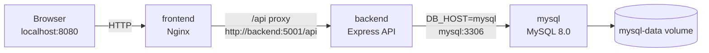

# Study Note Manager HANDOFF

> 과제 제출 및 유지보수를 위한 프로젝트 인수인계 문서

Study Note Manager는 Docker Compose 기반 3-tier 구조의 학습 노트 및 과제 메모 관리 웹서비스입니다. 이 문서는 현재 구현 상태, 실행 방법, 컨테이너 구조, API, DB schema, 유지보수 시 주의사항을 정리하여 다른 개발자 또는 다음 작업자가 바로 이어서 개발할 수 있도록 작성되었습니다.

---

## 1. 프로젝트 개요

| 항목 | 내용 |
| --- | --- |
| 프로젝트명 | Study Note Manager |
| 프로젝트 설명 | Docker Compose 기반 3-tier 구조의 학습 노트 및 과제 메모 관리 웹서비스 |
| 주요 목적 | 학습 노트와 과제 메모를 작성, 조회, 수정, 삭제하고 검색/필터링하는 웹서비스 구현 |
| 실행 환경 | localhost + Docker Compose |
| Frontend 접속 | `http://localhost:8080` |
| Backend API | `http://localhost:5001/api` |
| Database | MySQL 8.0 |
| 컨테이너 수 | 3개 이상: `frontend`, `backend`, `mysql` |
| 데이터 유지 | Docker named volume `mysql-data` |

### 현재 구현 상태

- frontend/backend/mysql 3-tier 구조 구현 완료
- Docker Compose 기반 다중 컨테이너 실행 완료
- 노트 CRUD 기능 구현 완료
- 검색 및 카테고리 필터 구현 완료
- 중요 노트 표시 및 중요 필터 구현 완료
- UTF-8 한글 처리 완료
- 반응형 UI 적용 완료
- UI/UX 개선 완료
- 제출용 README 및 AI_PROMPTS 작성 완료

---

## 2. 전체 폴더 구조

```text
Study_Note_Manager/
├── docker-compose.yml              # 전체 서비스 Compose 정의
├── .env.example                    # Compose 환경변수 예시
├── .gitignore
├── README.md                       # 과제 제출용 메인 문서
├── AI_PROMPTS.md                   # AI 활용 프롬프트 기록
├── HANDOFF.md                      # 현재 인수인계 문서
├── PROJECT_DESIGN.md               # 설계 설명 문서
├── DOCKER_COMPOSE_GUIDE.md         # Compose 실행 보조 문서
├── backend/                        # Application Tier
│   ├── Dockerfile
│   ├── package.json
│   ├── package-lock.json
│   ├── .env.example
│   └── src/
│       ├── app.js                  # Express 앱 설정
│       ├── server.js               # 서버 시작 및 DB 연결 대기
│       ├── db/
│       │   └── pool.js             # MySQL connection pool
│       ├── routes/
│       │   ├── healthRoutes.js     # /api/health 라우터
│       │   └── noteRoutes.js       # /api/notes 라우터
│       └── controllers/
│           └── noteController.js   # 노트 CRUD/검색/필터 로직
├── frontend/                       # Presentation Tier
│   ├── Dockerfile
│   ├── nginx.conf                  # 정적 파일 제공 및 /api proxy
│   ├── docker-entrypoint.sh        # env.js 생성 후 Nginx 실행
│   ├── env.template.js
│   ├── env.js
│   ├── index.html
│   ├── css/
│   │   └── style.css
│   └── js/
│       └── app.js                  # 브라우저 UI 및 API 연동 로직
├── db/                             # Data Tier 초기화 파일
│   └── init/
│       └── 01_init.sql             # DB/table 생성 SQL
└── docs/
    └── screenshots/
        └── README.md               # 실행 결과 캡처 저장 안내
```

---

## 3. frontend / backend / db 각 컨테이너 역할

| Tier | Compose 서비스 | 컨테이너명 | 기술 | 역할 |
| --- | --- | --- | --- | --- |
| Presentation Tier | `frontend` | `study-note-frontend` | Nginx + HTML/CSS/JavaScript | 사용자 UI 제공, 정적 파일 서빙, `/api` reverse proxy |
| Application Tier | `backend` | `study-note-backend` | Node.js + Express | REST API 제공, CRUD/검색/필터 처리, MySQL 질의 |
| Data Tier | `mysql` | `study-note-mysql` | MySQL 8.0 | 노트 데이터 저장, schema 초기화, volume persistence |

### 3.1 frontend 컨테이너

- `frontend/index.html`, `frontend/css/style.css`, `frontend/js/app.js`를 Nginx로 제공합니다.
- 사용자는 `http://localhost:8080`으로 접속합니다.
- 브라우저에서 `/api`로 요청하면 Nginx가 backend 컨테이너로 전달합니다.
- UI는 데스크톱/모바일 반응형 구조를 지원합니다.

### 3.2 backend 컨테이너

- Express 기반 REST API 서버입니다.
- `/api/health`, `/api/notes` 계열 API를 제공합니다.
- MySQL connection pool을 사용합니다.
- MySQL이 준비되기 전 서버가 실패하지 않도록 DB 연결 재시도 로직을 포함합니다.

### 3.3 mysql 컨테이너

- `mysql:8.0` 이미지를 사용합니다.
- 최초 실행 시 `db/init/01_init.sql`을 통해 DB와 `notes` 테이블을 생성합니다.
- `mysql-data` named volume을 사용하여 데이터가 컨테이너 재시작 후에도 유지됩니다.

---

## 4. docker-compose 구성 설명

`docker-compose.yml`은 다음 서비스를 정의합니다.

| 서비스 | build/image | 포트 매핑 | 주요 설정 |
| --- | --- | --- | --- |
| `frontend` | `build: ./frontend` | `${FRONTEND_PORT:-8080}:80` | `API_BASE_URL=/api`, backend 의존 |
| `backend` | `build: ./backend` | `${BACKEND_PORT:-5001}:5001` | `DB_HOST=mysql`, DB 연결 정보, mysql health 의존 |
| `mysql` | `mysql:8.0` | `${MYSQL_PORT:-3307}:3306` | `utf8mb4`, healthcheck, `mysql-data` volume |

### Compose 핵심 포인트

- 최소 3개 컨테이너 조건을 충족합니다.
- `docker compose up --build -d` 한 번으로 전체 서비스가 실행됩니다.
- `study-note-network` bridge network 안에서 서비스명 기반 DNS를 사용합니다.
- `mysql` 서비스는 healthcheck를 가지고, `backend`는 MySQL healthy 이후 시작됩니다.
- Backend 내부에도 DB 연결 재시도 로직이 있어 시작 안정성이 높습니다.

---

## 5. 컨테이너 간 연결 방식



| 연결 | 주소 | 설명 |
| --- | --- | --- |
| Browser → frontend | `http://localhost:8080` | 사용자 웹 화면 접속 |
| frontend → backend | `http://backend:5001/api/` | Nginx reverse proxy |
| backend → mysql | `mysql:3306` | Compose 서비스명 기반 DB 접속 |
| Host → backend | `http://localhost:5001/api` | API 직접 테스트 |
| Host → mysql | `localhost:3307` | DB 클라이언트 확인용 |

---

## 6. 사용 포트

| 서비스 | 컨테이너 내부 포트 | 호스트 포트 | 설명 |
| --- | ---: | ---: | --- |
| `frontend` | `80` | `8080` | 웹 UI 접속 |
| `backend` | `5001` | `5001` | REST API 직접 확인 |
| `mysql` | `3306` | `3307` | MySQL 접속 확인 |

로컬 실행 기준 URL:

```text
Frontend: http://localhost:8080
Backend health: http://localhost:5001/api/health
Backend notes API: http://localhost:5001/api/notes
MySQL: localhost:3307
```

---

## 7. 환경변수 설명

`.env.example` 기준입니다.

| 환경변수 | 기본값 | 설명 |
| --- | --- | --- |
| `FRONTEND_PORT` | `8080` | Frontend host port |
| `API_BASE_URL` | `/api` | Frontend 브라우저 코드의 API base URL |
| `BACKEND_PORT` | `5001` | Backend host port |
| `NODE_ENV` | `production` | Backend 실행 환경 |
| `CORS_ORIGIN` | `http://localhost:8080` | 허용할 Frontend origin |
| `DB_HOST` | `mysql` | Backend에서 접근할 DB 서비스명 |
| `DB_PORT` | `3306` | Backend에서 접근할 DB port |
| `DB_USER` | `study_user` | MySQL 사용자 |
| `DB_PASSWORD` | `study_password` | MySQL 사용자 비밀번호 |
| `DB_NAME` | `study_note_manager` | DB 이름 |
| `DB_CONNECTION_LIMIT` | `10` | MySQL pool connection limit |
| `DB_CHARSET` | `utf8mb4` | DB 연결 charset |
| `DB_CONNECT_RETRIES` | `30` | DB 연결 재시도 횟수 |
| `DB_CONNECT_RETRY_DELAY_MS` | `2000` | DB 연결 재시도 간격(ms) |
| `MYSQL_PORT` | `3307` | MySQL host port |
| `MYSQL_ROOT_PASSWORD` | `root_password` | MySQL root 비밀번호 |
| `MYSQL_DATABASE` | `study_note_manager` | 초기 생성 DB 이름 |
| `MYSQL_USER` | `study_user` | 초기 생성 DB 사용자 |
| `MYSQL_PASSWORD` | `study_password` | 초기 생성 DB 사용자 비밀번호 |

유지보수 시 주의:

- Compose 환경에서는 backend의 `DB_HOST`가 반드시 `mysql`이어야 합니다.
- 컨테이너 내부에서 다른 컨테이너를 `localhost`로 호출하면 안 됩니다.
- 실제 배포 환경에서는 기본 비밀번호를 변경해야 합니다.

---

## 8. API 목록 및 설명

Backend 기본 주소:

```text
http://localhost:5001/api
```

| Method | Endpoint | 설명 |
| --- | --- | --- |
| `GET` | `/api/health` | API 서버와 DB 연결 상태 확인 |
| `GET` | `/api/notes` | 노트 목록 조회, 검색/카테고리/중요 필터 지원 |
| `GET` | `/api/notes/search?q=키워드` | 전용 검색 API |
| `GET` | `/api/notes/:id` | 특정 노트 상세 조회 |
| `POST` | `/api/notes` | 노트 작성(Create) |
| `PUT` | `/api/notes/:id` | 노트 수정(Update) |
| `PATCH` | `/api/notes/:id/important` | 중요 표시만 변경 |
| `DELETE` | `/api/notes/:id` | 노트 삭제(Delete) |

### 요청 body 예시

```json
{
  "title": "운영체제 과제 정리",
  "content": "프로세스와 스레드 차이 정리",
  "category": "Assignment",
  "isImportant": true
}
```

### API 예외 처리 상태

- 제목/내용이 비어 있으면 `400` 응답을 반환합니다.
- 없는 노트 ID를 조회/수정/삭제하면 `404` 응답을 반환합니다.
- DB 연결 또는 쿼리 실패 시 `503` 응답을 반환합니다.
- 정의되지 않은 route는 `404 API route not found`를 반환합니다.
- 예상하지 못한 서버 오류는 `500 Internal server error`를 반환합니다.

---

## 9. DB schema 요약

DB 이름: `study_note_manager`

테이블: `notes`

| 컬럼 | 타입 | 설명 |
| --- | --- | --- |
| `id` | `INT AUTO_INCREMENT PRIMARY KEY` | 노트 고유 ID |
| `title` | `VARCHAR(120)` | 노트 제목 |
| `content` | `TEXT` | 노트 내용 |
| `category` | `VARCHAR(50)` | 카테고리 |
| `is_important` | `BOOLEAN` | 중요 표시 여부 |
| `created_at` | `TIMESTAMP` | 생성 시간 |
| `updated_at` | `TIMESTAMP` | 수정 시간 |

인덱스:

- `idx_notes_category`: 카테고리 필터 성능 보조
- `idx_notes_important`: 중요 노트 필터 성능 보조
- `ft_notes_search`: 제목/내용 검색용 FULLTEXT 인덱스

---

## 10. 실행 방법

### 10.1 최초 실행

```bash
cp .env.example .env
docker compose up --build -d
```

### 10.2 실행 상태 확인

```bash
docker compose ps
```

정상 상태 예시:

- `study-note-frontend`: Up, `0.0.0.0:8080->80/tcp`
- `study-note-backend`: Up, `0.0.0.0:5001->5001/tcp`
- `study-note-mysql`: Up, healthy, `0.0.0.0:3307->3306/tcp`

### 10.3 접속 확인

```text
http://localhost:8080
```

### 10.4 API 상태 확인

```bash
curl http://localhost:5001/api/health
```

### 10.5 중지

```bash
docker compose down
```

### 10.6 DB까지 초기화

```bash
docker compose down -v
docker compose up --build -d
```

주의: `down -v`는 `mysql-data` volume을 삭제하므로 저장된 노트가 모두 삭제됩니다.

---

## 11. 현재 완료된 기능

| 기능 | 상태 | 설명 |
| --- | --- | --- |
| 노트 작성(Create) | 완료 | 제목/내용/카테고리/중요 여부 입력 |
| 노트 조회(Read) | 완료 | 최신 노트 목록 조회 |
| 노트 수정(Update) | 완료 | 기존 노트를 폼에 불러와 수정 |
| 노트 삭제(Delete) | 완료 | 노트 카드에서 삭제 |
| 검색 | 완료 | 제목/내용 키워드 검색 |
| 카테고리 필터 | 완료 | 선택 카테고리 기준 필터 |
| 중요 표시 | 완료 | 별 토글 기반 중요 노트 표시 |
| 중요 필터 | 완료 | 중요 노트만 조회 |
| UTF-8 한글 처리 | 완료 | `utf8mb4` 기반 저장/조회 |
| 반응형 UI | 완료 | 데스크톱 2-column, 모바일 stacked layout |
| Docker Compose 실행 | 완료 | 3개 컨테이너 통합 실행 |
| MySQL persistence | 완료 | `mysql-data` volume 유지 |

---

## 12. 남은 작업

현재 과제 제출 기준으로 필수 기능은 완료된 상태입니다. 향후 유지보수 또는 확장 시 고려할 수 있는 작업은 다음과 같습니다.

| 작업 | 우선순위 | 설명 |
| --- | --- | --- |
| 사용자 인증 | 낮음 | 개인별 노트 관리를 위해 로그인 기능 추가 가능 |
| 카테고리 사용자 정의 | 낮음 | 고정 카테고리 외 사용자 정의 카테고리 추가 가능 |
| 페이지네이션 | 낮음 | 노트 수가 많아질 경우 목록 페이지네이션 추가 가능 |
| 테스트 자동화 | 중간 | API integration test, UI smoke test를 스크립트화 가능 |
| 배포 환경 분리 | 낮음 | production compose override 또는 reverse proxy 설정 확장 가능 |
| 보안 설정 강화 | 중간 | 실제 배포 시 DB 비밀번호, CORS, rate limit 등 강화 필요 |

---

## 13. README 작성 상태

`README.md`는 과제 제출용 메인 문서로 작성되어 있으며 다음 내용을 포함합니다.

- 프로젝트 개요 및 목적
- 3-tier 구조 설명
- Presentation / Application / Data Tier 구분
- Mermaid 기반 시스템 흐름도
- 각 컨테이너 역할
- 컨테이너 간 연결 방식
- 사용 포트
- 주요 환경변수
- 실행 방법 및 Docker Compose 명령
- API 설명 및 CRUD 예시
- 주요 기능 설명
- 실행 결과 캡처 위치
- 트러블슈팅
- 프로젝트 구조 설명
- 반응형 UI 설명
- Docker Compose network 설명
- MySQL volume persistence 설명
- 제출 산출물 구성

---

## 14. 실행 시 주의사항

1. Docker Desktop 또는 Docker daemon이 실행 중이어야 합니다.
2. `8080`, `5001`, `3307` 포트가 이미 사용 중이면 실행이 실패할 수 있습니다.
3. `.env` 파일이 없어도 compose 기본값으로 실행 가능하지만, 제출/시연 전 `cp .env.example .env`를 권장합니다.
4. `.env`, `backend/.env`, `node_modules`, `.omx`, `.DS_Store`는 Git에 포함하지 않습니다.
5. MySQL 데이터 초기화가 필요한 경우에만 `docker compose down -v`를 사용합니다.
6. Frontend는 `/api` 경로로 요청하므로 Nginx proxy 설정을 유지해야 합니다.
7. Backend 컨테이너에서 DB host는 `localhost`가 아니라 `mysql`이어야 합니다.

---

## 15. 트러블슈팅 포인트

| 문제 | 증상 | 확인/해결 방법 |
| --- | --- | --- |
| Docker daemon 미실행 | `Cannot connect to the Docker daemon` | Docker Desktop 실행 후 `docker info` 확인 |
| 포트 충돌 | `port is already allocated` | `8080`, `5001`, `3307` 사용 프로세스 종료 또는 `.env` 포트 변경 |
| DB 연결 실패 | `/api/health`에서 `database: disconnected` | `docker compose ps`, `docker compose logs mysql`, `docker compose logs backend` 확인 |
| MySQL 초기화 문제 | 테이블 없음, 접속 실패 | `docker compose down -v` 후 재실행. 단, 데이터 삭제 주의 |
| 한글 깨짐 | 저장된 노트가 깨져 보임 | `utf8mb4` 설정 확인, 기존 깨진 volume 초기화 |
| Frontend API 실패 | 화면은 보이나 노트 조회 실패 | `frontend/nginx.conf`의 `/api/` proxy와 backend 상태 확인 |
| 변경 사항 미반영 | 이전 CSS/JS가 보임 | 브라우저 강력 새로고침, `docker compose up --build -d` 재실행 |
| GitHub push 실패 | `could not read Username` 또는 `Permission denied` | GitHub HTTPS/SSH 인증 설정 필요 |

---

## 16. 과제 제출 전 최종 점검 항목

| 점검 항목 | 명령/확인 방법 | 상태 기준 |
| --- | --- | --- |
| Compose 설정 유효성 | `docker compose config` | 오류 없이 출력 |
| 전체 컨테이너 실행 | `docker compose up --build -d` | frontend/backend/mysql 실행 |
| 컨테이너 상태 | `docker compose ps` | mysql healthy, frontend/backend Up |
| Frontend 접속 | `http://localhost:8080` | UI 화면 표시 |
| Backend 상태 | `curl http://localhost:5001/api/health` | `database: connected` |
| Frontend 문법 | `node --check frontend/js/app.js` | 오류 없음 |
| Backend 문법 | `cd backend && npm run check` | 오류 없음 |
| CRUD 시연 | 브라우저 또는 curl | Create/Read/Update/Delete 정상 |
| 검색/필터 | 브라우저 UI | 검색, 카테고리, 중요 필터 정상 |
| 반응형 | 브라우저 폭 조절 | 모바일에서 세로 배치 |
| 문서 | README/AI_PROMPTS/HANDOFF | 제출 항목 포함 |
| 캡처 | `docs/screenshots/` | 실행 화면 캡처 저장 |

---

## 17. Docker volume persistence 설명

MySQL 데이터는 named volume `mysql-data`에 저장됩니다.

```yaml
volumes:
  mysql-data:
```

서비스 연결:

```yaml
volumes:
  - mysql-data:/var/lib/mysql
```

동작 방식:

- `docker compose restart` 후에도 데이터 유지
- `docker compose down` 후 재실행해도 데이터 유지
- `docker compose down -v` 실행 시 volume 삭제 및 데이터 초기화

과제 시연 중 데이터를 초기화해야 할 때만 `down -v`를 사용하세요.

---

## 18. UTF-8 한글 처리 설명

한글 노트 제목과 내용을 깨지지 않게 저장하기 위해 다음 설정을 적용했습니다.

| 위치 | 설정 |
| --- | --- |
| MySQL server command | `--character-set-server=utf8mb4` |
| MySQL collation | `--collation-server=utf8mb4_unicode_ci` |
| MySQL client handshake | `--skip-character-set-client-handshake` |
| DB init SQL | `SET NAMES utf8mb4`, 컬럼별 `CHARACTER SET utf8mb4` |
| Backend env | `DB_CHARSET=utf8mb4` |
| Express response | `application/json; charset=utf-8` |

이 설정으로 `한글 테스트 노트`, `과제 메모`, `가나다` 같은 한글 데이터 저장/조회가 가능합니다.

---

## 19. 반응형 UI 구조 설명

Frontend UI는 `frontend/css/style.css`의 CSS grid와 media query로 반응형을 처리합니다.

### 데스크톱

- 좌측: 새 노트 작성/수정 폼
- 우측: 노트 목록, 검색, 필터
- 2-column layout 유지

### 중간 화면

- grid 폭이 줄어들고 toolbar 내부 요소가 줄바꿈됩니다.
- 검색창은 넓게 유지하고 필터 요소는 공간에 맞게 배치됩니다.

### 모바일

- 작성 폼과 노트 목록이 세로로 쌓입니다.
- 검색창, 카테고리 필터, 중요 필터가 한 줄씩 보기 좋게 정렬됩니다.
- 노트 카드의 수정/중요/삭제 버튼도 세로 배치되어 터치하기 쉽습니다.

---

## 20. 유지보수 권장 순서

1. `git status --short`로 변경 상태 확인
2. `docker compose config`로 Compose 설정 확인
3. `node --check frontend/js/app.js` 및 `cd backend && npm run check` 실행
4. `docker compose up --build -d` 실행
5. 브라우저에서 CRUD 및 필터 기능 확인
6. README/HANDOFF/AI_PROMPTS 문서가 실제 설정과 일치하는지 확인
7. 테스트 데이터 삭제 후 제출 상태 정리

---

## 21. 요약

Study Note Manager는 현재 과제 제출 기준에 맞는 3-tier Docker Compose 웹서비스로 정리되어 있습니다. Frontend, Backend, MySQL 컨테이너가 분리되어 있고, Compose network를 통해 연결되며, MySQL volume으로 데이터를 유지합니다. README와 AI_PROMPTS 문서가 준비되어 있으므로 이 HANDOFF 문서를 함께 제출하면 프로젝트 구조와 유지보수 흐름을 명확하게 설명할 수 있습니다.
