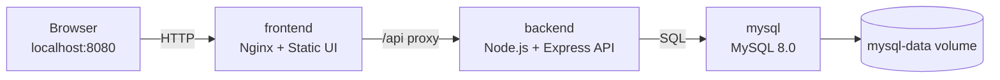

# Study Note Manager 프로젝트 설계 문서

> Docker Compose 기반 3-tier 구조의 학습 노트 및 과제 메모 관리 웹서비스 설계 정리

이 문서는 Study Note Manager의 최종 구현 상태를 기준으로 프로젝트 구조, Tier별 책임, 컨테이너 연결 방식, 데이터 흐름, 주요 기능을 설명한다. 과제 제출 시 README와 함께 3-tier 설계 근거 문서로 사용할 수 있다.

---

## 1. 설계 목표

Study Note Manager는 학습 노트와 과제 메모를 웹에서 작성, 조회, 수정, 삭제할 수 있는 CRUD 서비스이다. 설계 목표는 다음과 같다.

| 목표 | 설명 |
| --- | --- |
| 3-tier 분리 | Presentation, Application, Data Tier를 명확히 분리한다. |
| Docker Compose 실행 | `docker compose up --build -d` 한 번으로 전체 서비스를 실행한다. |
| localhost 시연 | 사용자는 `http://localhost:8080`에서 UI를 확인할 수 있다. |
| 데이터 영속성 | MySQL 데이터를 `mysql-data` Docker volume으로 유지한다. |
| 제출용 완성도 | README, AI_PROMPTS, HANDOFF 문서와 UI/UX polish를 포함한다. |

---

## 2. 최종 폴더 구조

```text
Study_Note_Manager/
├── docker-compose.yml
├── .env.example
├── README.md
├── AI_PROMPTS.md
├── HANDOFF.md
├── DOCKER_COMPOSE_GUIDE.md
├── PROJECT_DESIGN.md
├── backend/                         # Application Tier
│   ├── Dockerfile
│   ├── package.json
│   ├── package-lock.json
│   ├── .env.example
│   └── src/
│       ├── app.js                   # Express 앱 설정
│       ├── server.js                # 서버 시작 및 DB 연결 대기
│       ├── db/
│       │   └── pool.js              # MySQL connection pool
│       ├── routes/
│       │   ├── healthRoutes.js      # health check API
│       │   └── noteRoutes.js        # note API routes
│       └── controllers/
│           └── noteController.js    # note CRUD 로직
├── frontend/                        # Presentation Tier
│   ├── Dockerfile
│   ├── nginx.conf                   # 정적 파일 서빙 및 /api proxy
│   ├── docker-entrypoint.sh         # env.js 생성 후 Nginx 실행
│   ├── env.template.js
│   ├── env.js
│   ├── index.html
│   ├── css/
│   │   └── style.css
│   └── js/
│       └── app.js
├── db/                              # Data Tier 초기화 파일
│   └── init/
│       └── 01_init.sql
└── docs/
    └── screenshots/                 # 실행 결과 캡처 저장 권장 위치
```

---

## 3. 3-tier 구조

| Tier | Compose 서비스 | 컨테이너명 | 기술 | 역할 |
| --- | --- | --- | --- | --- |
| Presentation Tier | `frontend` | `study-note-frontend` | Nginx + HTML/CSS/JS | 사용자 UI 제공, `/api` reverse proxy |
| Application Tier | `backend` | `study-note-backend` | Node.js + Express | REST API, 요청 검증, MySQL 질의 |
| Data Tier | `mysql` | `study-note-mysql` | MySQL 8.0 | 노트 데이터 저장, volume 기반 persistence |

### 책임 분리 원칙

- Frontend는 MySQL에 직접 접근하지 않는다.
- Backend만 MySQL과 통신한다.
- Browser는 `localhost:8080`으로 Frontend에 접속한다.
- Frontend Nginx가 `/api` 요청을 `backend:5001`로 전달한다.
- Backend는 Compose 서비스명 `mysql`을 사용해 DB에 접근한다.

---

## 4. 시스템 흐름



---

## 5. Docker Compose 설계

현재 `docker-compose.yml`은 세 개의 서비스를 정의한다.

| 서비스 | 빌드/이미지 | 포트 | 네트워크 | 비고 |
| --- | --- | --- | --- | --- |
| `frontend` | `./frontend` Dockerfile | `8080:80` | `study-note-network` | Nginx 정적 파일 서버 |
| `backend` | `./backend` Dockerfile | `5001:5001` | `study-note-network` | Express API 서버 |
| `mysql` | `mysql:8.0` | `3307:3306` | `study-note-network` | DB + healthcheck + volume |

### 네트워크

```yaml
networks:
  study-note-network:
    driver: bridge
```

### 볼륨

```yaml
volumes:
  mysql-data:
```

MySQL 데이터는 `mysql-data:/var/lib/mysql`에 저장된다. 따라서 `docker compose down` 후 재실행해도 데이터가 유지된다. `docker compose down -v`를 실행하면 volume까지 삭제되어 데이터가 초기화된다.

---

## 6. 포트 설계

| 대상 | localhost 주소 | 설명 |
| --- | --- | --- |
| Frontend | `http://localhost:8080` | 사용자가 접속하는 웹 화면 |
| Backend API | `http://localhost:5001/api` | API 직접 테스트용 |
| Health Check | `http://localhost:5001/api/health` | API 및 DB 연결 상태 확인 |
| MySQL | `localhost:3307` | DB 클라이언트 접속 확인용 |

포트는 과제 시연 환경에서 흔히 사용되는 `3000`, `5000`, `3306` 직접 충돌을 피하기 위해 Frontend `8080`, Backend `5001`, MySQL host `3307`로 구성했다.

---

## 7. 데이터베이스 설계

DB 이름: `study_note_manager`

주요 테이블: `notes`

| 컬럼 | 타입 | 설명 |
| --- | --- | --- |
| `id` | `INT AUTO_INCREMENT` | 노트 ID |
| `title` | `VARCHAR(120)` | 노트 제목 |
| `content` | `TEXT` | 노트 내용 |
| `category` | `VARCHAR(50)` | 카테고리 |
| `is_important` | `BOOLEAN` | 중요 표시 여부 |
| `created_at` | `TIMESTAMP` | 생성 시각 |
| `updated_at` | `TIMESTAMP` | 수정 시각 |

한글 처리를 위해 DB, 테이블, 주요 컬럼, 연결 charset은 `utf8mb4`와 `utf8mb4_unicode_ci` 기준으로 설정했다.

---

## 8. API 설계

| Method | Endpoint | 역할 |
| --- | --- | --- |
| `GET` | `/api/health` | 서버 및 DB 연결 상태 확인 |
| `GET` | `/api/notes` | 노트 목록 조회, 검색/카테고리/중요 필터 |
| `GET` | `/api/notes/search?q=keyword` | 전용 검색 API |
| `GET` | `/api/notes/:id` | 단일 노트 조회 |
| `POST` | `/api/notes` | 노트 작성 |
| `PUT` | `/api/notes/:id` | 노트 수정 |
| `PATCH` | `/api/notes/:id/important` | 중요 표시 변경 |
| `DELETE` | `/api/notes/:id` | 노트 삭제 |

---

## 9. Frontend UI 설계

- 데스크톱: 좌측 작성 폼, 우측 노트 목록의 2-column 구조
- 모바일: 작성 폼과 노트 목록이 세로로 배치
- 검색창, 카테고리 필터, 중요 필터는 화면 폭에 따라 줄바꿈
- 중요 표시 UI는 체크박스 대신 별 아이콘 토글 사용
- 노트가 없을 때 empty state 안내 제공
- 상단 로고는 외부 이미지 없이 inline SVG로 구현

---

## 10. 제출 기준 대응

| 평가 조건 | 대응 내용 |
| --- | --- |
| Docker/Compose 기반 3-tier | `frontend`, `backend`, `mysql` 3개 서비스로 구성 |
| localhost 정상 실행 | `http://localhost:8080` 기준 실행 |
| 최소 3개 컨테이너 | frontend/backend/mysql 컨테이너 사용 |
| 전체 서비스 동시 실행 | `docker compose up --build -d` 사용 |
| README 설명 | 구조, 포트, API, 흐름도, 실행법, troubleshooting 포함 |
| AI_PROMPTS | 프롬프트 요약, 목적, 반영 내용 표로 정리 |
| 실행 캡처 | `docs/screenshots/` 위치 안내 |

---

## 11. 권장 검증 명령

```bash
docker compose config
docker compose up --build -d
docker compose ps
curl http://localhost:5001/api/health
node --check frontend/js/app.js
cd backend && npm run check
```

---

## 12. 요약

Study Note Manager는 과제 제출 조건에 맞춰 Docker Compose 기반 3-tier 구조를 명확히 갖춘 웹서비스이다. Presentation Tier는 Nginx와 정적 Frontend, Application Tier는 Express API, Data Tier는 MySQL로 분리되어 있으며, Compose network와 named volume을 통해 컨테이너 간 통신과 데이터 영속성을 구현했다.
