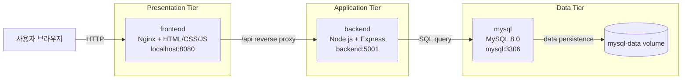
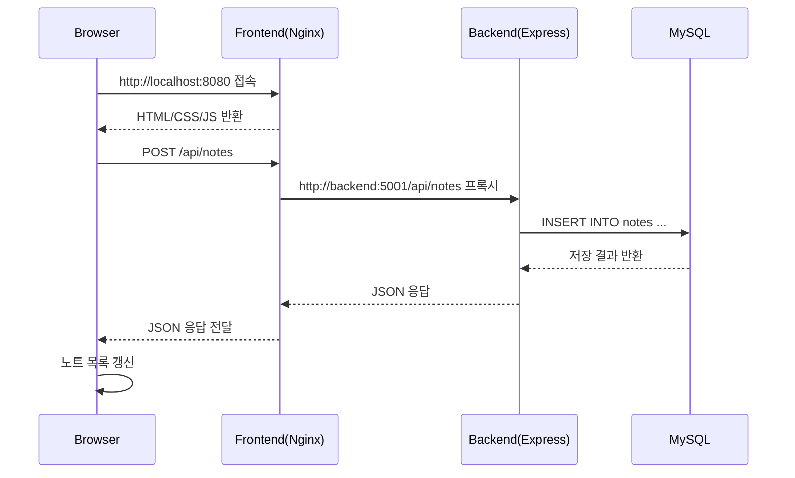

# Study Note Manager

Docker Compose를 사용하여 구현한 3-tier 구조의 학습 노트 관리 웹서비스입니다. 사용자는 브라우저에서 노트를 작성하고, 수정/삭제하거나 검색 및 필터를 이용해 필요한 내용을 확인할 수 있습니다.

---

## 1. 프로젝트 개요

| 항목 | 내용 |
| --- | --- |
| 프로젝트명 | Study Note Manager |
| 목적 | 강의 노트와 과제 메모를 한 곳에서 관리하는 웹서비스 구현 |
| 구조 | Docker Compose 기반 3-tier 구조 |
| 실행 환경 | localhost |
| Frontend | `http://localhost:8080` |
| Backend API | `http://localhost:5001/api` |
| Database | MySQL 8.0 |

주요 기능은 노트 작성, 조회, 수정, 삭제(CRUD), 검색, 카테고리 필터, 중요 표시입니다. 과제 조건에 맞게 Presentation Tier, Application Tier, Data Tier를 각각 독립된 컨테이너로 분리했습니다.

---

## 2. 기술 스택

| 구분 | 사용 기술 |
| --- | --- |
| Presentation Tier | HTML, CSS, JavaScript, Nginx |
| Application Tier | Node.js, Express |
| Data Tier | MySQL 8.0 |
| 실행 환경 | Docker, Docker Compose |
| 네트워크 | Docker Compose bridge network |
| 데이터 유지 | Docker named volume `mysql-data` |

---

## 3. 3-tier 구조

| Tier | Compose 서비스 | 컨테이너 이름 | 역할 |
| --- | --- | --- | --- |
| Presentation Tier | `frontend` | `study-note-frontend` | 사용자 화면 제공, 정적 파일 서빙, `/api` 요청 프록시 |
| Application Tier | `backend` | `study-note-backend` | REST API 제공, CRUD/검색/필터 처리, DB 질의 |
| Data Tier | `mysql` | `study-note-mysql` | 노트 데이터 저장, 테이블 초기화, volume 기반 데이터 유지 |

### 3.1 Presentation Tier: frontend

- Nginx로 `index.html`, CSS, JavaScript 파일을 제공합니다.
- 사용자는 `http://localhost:8080`으로 접속합니다.
- 브라우저의 `/api` 요청은 Nginx 설정을 통해 backend 컨테이너로 전달됩니다.

### 3.2 Application Tier: backend

- Express 기반 REST API 서버입니다.
- 노트 생성, 조회, 수정, 삭제, 검색, 카테고리 필터, 중요 표시 기능을 처리합니다.
- MySQL 연결 pool을 사용하며, DB가 준비될 때까지 재시도하는 로직을 포함합니다.

### 3.3 Data Tier: mysql

- MySQL 8.0 컨테이너입니다.
- `db/init/01_init.sql`을 통해 초기 테이블을 생성합니다.
- `mysql-data` named volume을 사용해 컨테이너 재시작 후에도 데이터를 유지합니다.

---

## 4. 전체 흐름도



노트 작성 요청의 처리 흐름은 다음과 같습니다.



---

## 5. 컨테이너 구성

`docker-compose.yml`에는 세 개의 서비스가 정의되어 있습니다.

| 서비스 | 빌드/이미지 | 포트 매핑 | 주요 설정 |
| --- | --- | --- | --- |
| `frontend` | `./frontend` Dockerfile | `8080:80` | Nginx, `/api` reverse proxy |
| `backend` | `./backend` Dockerfile | `5001:5001` | Express API, `DB_HOST=mysql` |
| `mysql` | `mysql:8.0` | `3307:3306` | `utf8mb4`, healthcheck, `mysql-data` volume |

세 컨테이너는 `study-note-network`라는 Compose bridge network에 연결됩니다.

```yaml
networks:
  study-note-network:
    driver: bridge
```

컨테이너 내부에서는 `localhost`가 아니라 Compose 서비스명을 사용합니다.

| 연결 | 주소 | 설명 |
| --- | --- | --- |
| Browser → frontend | `http://localhost:8080` | 웹 화면 접속 |
| frontend → backend | `http://backend:5001/api/` | Nginx proxy |
| backend → mysql | `mysql:3306` | DB 접속 |
| Host → backend | `http://localhost:5001/api` | API 직접 테스트 |
| Host → mysql | `localhost:3307` | DB 클라이언트 접속 |

---

## 6. 포트 정보

| 서비스 | 컨테이너 포트 | 호스트 포트 | 용도 |
| --- | ---: | ---: | --- |
| frontend | `80` | `8080` | 웹 UI 접속 |
| backend | `5001` | `5001` | REST API 확인 |
| mysql | `3306` | `3307` | MySQL 직접 접속 |

localhost 기준 주소는 다음과 같습니다.

```text
Frontend: http://localhost:8080
Backend API: http://localhost:5001/api
Backend Health Check: http://localhost:5001/api/health
MySQL: localhost:3307
```

---

## 7. 주요 환경변수

`.env.example`은 실행에 필요한 키와 예시 placeholder를 보여주는 템플릿입니다. 실제 실행 비밀번호는 `.env.example`에 저장하지 말고, 로컬에서만 사용하는 `.env`에 직접 설정합니다.

| 환경변수 | 예시 값 | 설명 |
| --- | --- | --- |
| `FRONTEND_PORT` | `8080` | Frontend 호스트 포트 |
| `API_BASE_URL` | `/api` | Frontend API base URL |
| `BACKEND_PORT` | `5001` | Backend 호스트 포트 |
| `CORS_ORIGIN` | `http://localhost:8080` | 허용할 Frontend origin |
| `DB_HOST` | `mysql` | Backend에서 접근할 DB 서비스명 |
| `DB_PORT` | `3306` | Backend에서 접근할 DB 포트 |
| `DB_USER` | `study_user` | MySQL 사용자 |
| `DB_PASSWORD` | `REPLACE_WITH_LOCAL_DB_PASSWORD` | Backend가 사용할 MySQL 비밀번호 placeholder |
| `DB_NAME` | `study_note_manager` | MySQL 데이터베이스명 |
| `DB_CHARSET` | `utf8mb4` | DB 문자셋 |
| `MYSQL_PORT` | `3307` | MySQL 호스트 포트 |
| `MYSQL_ROOT_PASSWORD` | `REPLACE_WITH_LOCAL_ROOT_PASSWORD` | MySQL root 비밀번호 placeholder |
| `MYSQL_DATABASE` | `study_note_manager` | 초기 생성 DB명 |
| `MYSQL_USER` | `study_user` | 초기 생성 사용자 |
| `MYSQL_PASSWORD` | `REPLACE_WITH_LOCAL_DB_PASSWORD` | 초기 생성 사용자 비밀번호 placeholder |

`DB_PASSWORD`와 `MYSQL_PASSWORD`는 같은 MySQL 사용자(`MYSQL_USER`/`DB_USER`)에 대한 값이므로 일반적으로 동일하게 설정합니다. 실제 비밀번호를 저장하는 `.env` 파일은 Git에 포함하지 않고, 제출용 예시는 `.env.example`로만 관리합니다.

---

## 8. 실행 방법

### 8.1 사전 준비

- Docker Desktop 또는 Docker Engine
- Docker Compose v2

버전 확인:

```bash
docker --version
docker compose version
```

### 8.2 환경변수 파일 생성

`.env.example`을 로컬 실행용 `.env`로 복사한 뒤, placeholder 비밀번호를 실제 로컬 값으로 변경합니다. `.env`는 `.gitignore`에 포함되어 있으므로 Git에 커밋하지 않습니다.

```bash
cp .env.example .env
# 편집기에서 DB_PASSWORD, MYSQL_PASSWORD, MYSQL_ROOT_PASSWORD 값을 로컬 비밀번호로 변경
```

### 8.3 빌드 및 실행

```bash
docker compose up --build
```

백그라운드에서 실행하려면 다음 명령을 사용합니다.

```bash
docker compose up --build -d
```

### 8.4 상태 확인

```bash
docker compose ps
```

정상 실행 시 frontend, backend, mysql 컨테이너가 실행되고 mysql은 healthy 상태가 됩니다.

### 8.5 로그 확인

```bash
docker compose logs -f
```

특정 서비스만 확인할 수도 있습니다.

```bash
docker compose logs -f backend
docker compose logs -f frontend
docker compose logs -f mysql
```

### 8.6 종료

```bash
docker compose down
```

DB volume까지 삭제하고 초기화하려면 다음 명령을 사용합니다.

```bash
docker compose down -v
```

`down -v`는 저장된 MySQL 데이터도 삭제하므로 필요할 때만 사용해야 합니다.

### 8.7 DB 비밀번호 변경 후 접속 오류가 나는 경우

MySQL은 최초 초기화 시점의 사용자/비밀번호를 `mysql-data` volume에 저장합니다. `.env`에서 `MYSQL_PASSWORD`, `MYSQL_ROOT_PASSWORD`, `DB_PASSWORD`를 변경한 뒤 기존 volume을 그대로 재사용하면 backend가 이전 비밀번호로 생성된 DB에 접속하지 못할 수 있습니다.

로컬 데이터를 초기화해도 되는 상황이면 다음 명령으로 volume을 삭제한 뒤 다시 실행합니다.

```bash
docker compose down -v
docker compose up --build -d
```

`docker compose down -v`는 저장된 MySQL 데이터를 삭제하므로 필요한 데이터가 있으면 먼저 백업합니다.

---

## 9. API 요약

Backend 기본 주소는 `http://localhost:5001/api`입니다. Frontend에서는 `/api`로 요청하고, Nginx가 내부적으로 backend 서비스에 전달합니다.

| Method | Endpoint | 설명 |
| --- | --- | --- |
| `GET` | `/api/health` | API 서버와 DB 연결 상태 확인 |
| `GET` | `/api/notes` | 노트 목록 조회, 검색/카테고리/중요 필터 지원 |
| `GET` | `/api/notes/search?q=키워드` | 검색 전용 API |
| `GET` | `/api/notes/:id` | 특정 노트 조회 |
| `POST` | `/api/notes` | 새 노트 작성 |
| `PUT` | `/api/notes/:id` | 노트 수정 |
| `PATCH` | `/api/notes/:id/important` | 중요 표시 변경 |
| `DELETE` | `/api/notes/:id` | 노트 삭제 |

Health check 예시:

```bash
curl http://localhost:5001/api/health
```

예상 응답:

```json
{
  "success": true,
  "status": "ok",
  "database": "connected",
  "timestamp": "2026-05-20T00:00:00.000Z"
}
```

---

## 10. 주요 기능

| 기능 | 설명 |
| --- | --- |
| 노트 작성(Create) | 제목, 카테고리, 내용, 중요 여부를 입력해 노트를 저장합니다. |
| 노트 조회(Read) | 저장된 노트를 최신순으로 조회하고, 중요 노트를 강조합니다. |
| 노트 수정(Update) | 기존 노트를 불러와 제목, 내용, 카테고리, 중요 여부를 수정합니다. |
| 노트 삭제(Delete) | 선택한 노트를 삭제하고 목록을 다시 불러옵니다. |
| 검색 | 제목 또는 내용에 포함된 키워드로 노트를 찾습니다. |
| 카테고리 필터 | `General`, `Lecture`, `Assignment`, `Exam`, `Project`, `Reading` 등으로 필터링합니다. |
| 중요 표시 | 별 아이콘으로 중요 노트를 표시하고, 중요한 노트만 볼 수 있습니다. |
| 반응형 UI | 데스크톱에서는 2-column, 작은 화면에서는 세로 배치로 표시됩니다. |

---

## 11. 데이터 저장 방식

MySQL 데이터는 named volume에 저장됩니다.

```yaml
volumes:
  mysql-data:
```

MySQL 컨테이너에는 다음과 같이 연결됩니다.

```yaml
volumes:
  - mysql-data:/var/lib/mysql
```

이 설정으로 `docker compose down` 후 다시 실행해도 데이터가 유지됩니다. 단, `docker compose down -v`를 실행하면 volume이 삭제되어 DB가 초기화됩니다.

---

## 12. 실행 결과 캡처

실행 결과 캡처는 다음 폴더에 저장하는 것을 권장합니다.

```text
docs/screenshots/
```

예시 파일명:

```text
docs/screenshots/01-main-page.png
docs/screenshots/02-create-note.png
docs/screenshots/03-edit-note.png
docs/screenshots/04-search-filter.png
docs/screenshots/05-responsive-mobile.png
```

현재 저장소에는 캡처 파일을 직접 포함하지 않았습니다. 제출할 때 `http://localhost:8080` 접속 화면과 CRUD 동작 화면을 캡처하여 첨부하면 됩니다.

---

## 13. 프로젝트 구조

```text
Study_Note_Manager/
├── docker-compose.yml          # 전체 컨테이너 실행 정의
├── .env.example                # Docker Compose 환경변수 예시
├── README.md                   # 과제 보고서 문서
├── AI_PROMPTS.md               # AI 활용 프롬프트 기록
├── HANDOFF.md                  # 실행 및 제출 전 확인 요약
├── backend/                    # Application Tier
│   ├── Dockerfile
│   ├── package.json
│   ├── .env.example
│   └── src/
├── frontend/                   # Presentation Tier
│   ├── Dockerfile
│   ├── nginx.conf
│   ├── index.html
│   ├── css/style.css
│   └── js/app.js
├── db/init/01_init.sql          # Data Tier 초기화 SQL
└── docs/screenshots/README.md   # 실행 캡처 안내
```

---

## 14. AI 활용 기록

개발 과정에서 사용한 AI 프롬프트와 반영 내용은 `AI_PROMPTS.md`에 정리했습니다.

해당 문서에는 다음 내용이 포함되어 있습니다.

- 사용한 프롬프트 요약
- 프롬프트를 사용한 목적
- 실제 프로젝트에 반영된 내용
- Docker, 3-tier 구조, UI 개선, 오류 해결 과정

---

## 15. 제출 전 확인 명령

```bash
git status
git ls-files | grep '\.env'
docker compose config
cd backend && npm run check
node --check frontend/js/app.js
docker compose up --build -d
```

확인할 내용:

- `.env` 파일이 Git에 포함되지 않았는지 확인합니다.
- `.env.example`, `backend/.env.example`만 제출용 예시 파일로 포함합니다.
- `node_modules`, Docker volume, 임시 파일이 Git에 포함되지 않았는지 확인합니다.
- `http://localhost:8080`에서 화면이 열리는지 확인합니다.
- `http://localhost:5001/api/health`에서 DB 연결 상태가 정상인지 확인합니다.

---

## 16. 제출 산출물

| 파일/폴더 | 설명 |
| --- | --- |
| `README.md` | 프로젝트 개요, 3-tier 구조, 실행 방법, 포트, 컨테이너 연결 방식 설명 |
| `AI_PROMPTS.md` | 사용한 AI 프롬프트, 사용 목적, 반영 내용 정리 |
| `HANDOFF.md` | 실행 방법, 검증 명령, 제출 전 주의사항 요약 |
| `docs/screenshots/` | 실행 결과 캡처 저장 위치 |

---

## 17. 정리

Study Note Manager는 `frontend`, `backend`, `mysql` 세 컨테이너로 구성된 Docker Compose 기반 3-tier 웹서비스입니다. 사용자는 `http://localhost:8080`에서 노트를 관리하고, frontend는 `/api` 요청을 backend로 전달하며, backend는 MySQL에 데이터를 저장합니다.

이 프로젝트는 과제 조건에서 요구한 3-tier 구분, 컨테이너 역할, 연결 방식, 포트 정보, 실행 방법, AI 활용 기록을 문서로 정리했습니다.
