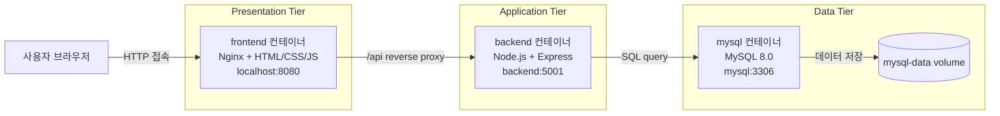
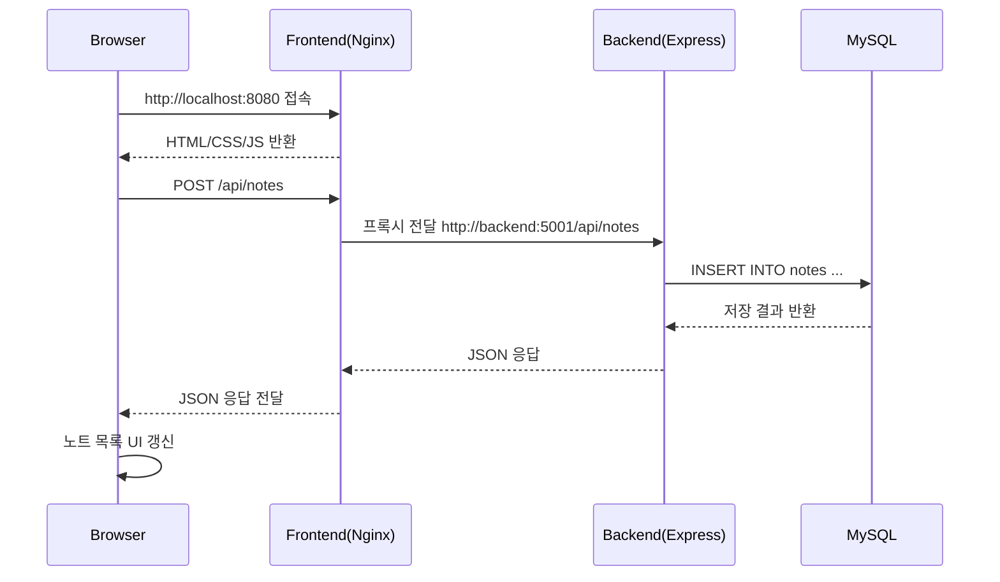

# Study Note Manager

> Docker Compose 기반 3-tier 구조의 학습 노트 및 과제 메모 관리 웹서비스

Study Note Manager는 강의 노트, 과제 메모, 시험 준비 내용 등을 한 곳에서 작성하고 관리할 수 있는 웹 애플리케이션입니다. Frontend, Backend, Database를 각각 독립 컨테이너로 분리한 3-tier 구조로 구성했으며, `docker compose up --build` 명령 한 번으로 전체 서비스를 실행할 수 있도록 설계했습니다.

---

## 1. 프로젝트 개요

| 항목 | 내용 |
| --- | --- |
| 프로젝트명 | Study Note Manager |
| 프로젝트 유형 | 학습 노트 및 과제 메모 관리 웹서비스 |
| 아키텍처 | Docker Compose 기반 3-tier 구조 |
| 실행 기준 | localhost |
| Frontend 접속 주소 | `http://localhost:8080` |
| Backend API 주소 | `http://localhost:5001/api` |
| Database | MySQL 8.0 |

본 프로젝트는 사용자가 웹 화면에서 노트를 작성하고, 카테고리별로 분류하며, 중요한 노트를 표시하거나 검색할 수 있도록 구현한 CRUD 기반 웹서비스입니다.

---

## 2. 프로젝트 목적

이 프로젝트의 목적은 단순한 정적 웹페이지가 아니라 실제 서비스 구조에 가까운 다중 컨테이너 웹 애플리케이션을 구현하는 것입니다.

주요 목표는 다음과 같습니다.

1. **3-tier 아키텍처 이해 및 구현**
   - Presentation Tier, Application Tier, Data Tier를 분리합니다.
   - 각 Tier를 독립 컨테이너로 실행합니다.

2. **Docker Compose 기반 통합 실행 환경 구성**
   - Frontend, Backend, MySQL 컨테이너를 하나의 Compose 파일로 관리합니다.
   - 컨테이너 간 네트워크와 의존성을 명확히 구성합니다.

3. **CRUD 기반 웹서비스 구현**
   - 노트 작성, 조회, 수정, 삭제 기능을 제공합니다.
   - 검색, 카테고리 필터, 중요 노트 표시 기능을 추가하여 실제 사용성을 높였습니다.

4. **과제 제출용 완성도 확보**
   - 반응형 UI, empty state, Docker volume, 환경변수, API 문서 등을 포함하여 제출용 프로젝트 문서로 활용할 수 있도록 구성했습니다.

---

## 3. 기술 스택

| 영역 | 기술 |
| --- | --- |
| Frontend | HTML, CSS, JavaScript, Nginx |
| Backend | Node.js, Express |
| Database | MySQL 8.0 |
| Infra | Docker, Docker Compose |
| Network | Docker Compose bridge network |
| Persistence | Docker named volume `mysql-data` |

---

## 4. 3-tier 구조 설명

Study Note Manager는 다음과 같은 3-tier 구조로 구성됩니다.

### 4.1 Presentation Tier

- 서비스명: `frontend`
- 기술: HTML/CSS/JavaScript + Nginx
- 역할:
  - 사용자가 접속하는 웹 UI 제공
  - 노트 작성/수정 폼 제공
  - 노트 목록, 검색, 카테고리 필터, 중요 필터 UI 제공
  - `/api` 요청을 Backend 컨테이너로 프록시

### 4.2 Application Tier

- 서비스명: `backend`
- 기술: Node.js + Express
- 역할:
  - REST API 제공
  - 노트 CRUD 처리
  - 검색, 카테고리 필터, 중요 노트 필터 처리
  - MySQL과 연결하여 데이터 조회/저장/수정/삭제 수행
  - DB 연결 실패 시 재시도 로직 수행

### 4.3 Data Tier

- 서비스명: `mysql`
- 기술: MySQL 8.0
- 역할:
  - 노트 데이터 영구 저장
  - `notes` 테이블 관리
  - Docker named volume을 통해 컨테이너 재시작 후에도 데이터 유지

---

## 5. Presentation / Application / Data Tier 구분

| Tier | 컨테이너 | 주요 포트 | 주요 책임 |
| --- | --- | ---: | --- |
| Presentation Tier | `study-note-frontend` | `8080 -> 80` | 사용자 화면 제공, 정적 파일 서빙, API reverse proxy |
| Application Tier | `study-note-backend` | `5001 -> 5001` | REST API, 비즈니스 로직, DB 질의 |
| Data Tier | `study-note-mysql` | `3307 -> 3306` | MySQL 데이터 저장, volume 기반 persistence |

---

## 6. 전체 시스템 흐름도



---

## 7. 요청 처리 흐름

예를 들어 사용자가 노트를 작성하면 다음 순서로 처리됩니다.



---

## 8. 각 컨테이너 역할

### 8.1 frontend 컨테이너

- Nginx 기반 정적 파일 서버입니다.
- `frontend/index.html`, `frontend/css/style.css`, `frontend/js/app.js`를 제공합니다.
- 브라우저에서 발생하는 `/api` 요청을 backend 서비스로 프록시합니다.
- 외부 사용자는 `http://localhost:8080`으로 접속합니다.

### 8.2 backend 컨테이너

- Express 기반 REST API 서버입니다.
- 노트 CRUD API를 제공합니다.
- MySQL 연결 pool을 사용합니다.
- DB 연결이 준비될 때까지 재시도하는 로직을 포함합니다.
- 외부 테스트용으로 `http://localhost:5001/api` 주소를 사용할 수 있습니다.

### 8.3 mysql 컨테이너

- MySQL 8.0 데이터베이스입니다.
- 초기 실행 시 `db/init/01_init.sql` 파일을 통해 데이터베이스와 `notes` 테이블을 생성합니다.
- `mysql-data` volume을 사용하여 데이터가 컨테이너 삭제/재생성 이후에도 유지됩니다.

---

## 9. 컨테이너 간 연결 방식

Docker Compose는 같은 Compose 파일에 정의된 서비스들을 하나의 bridge network에 연결합니다.

현재 네트워크 이름은 다음과 같습니다.

```yaml
networks:
  study-note-network:
    driver: bridge
```

컨테이너는 localhost가 아니라 **서비스명**으로 서로 통신합니다.

| 출발 컨테이너 | 도착 컨테이너 | 연결 주소 | 설명 |
| --- | --- | --- | --- |
| frontend | backend | `http://backend:5001/api/` | Nginx reverse proxy |
| backend | mysql | `mysql:3306` | MySQL 접속 |
| browser | frontend | `http://localhost:8080` | 사용자 웹 접속 |
| host | backend | `http://localhost:5001/api` | API 직접 테스트 |
| host | mysql | `localhost:3307` | DB 직접 확인용 |

---

## 10. 사용 포트

현재 실제 사용 포트는 다음과 같습니다.

| 서비스 | 컨테이너 내부 포트 | 호스트 포트 | 용도 |
| --- | ---: | ---: | --- |
| frontend | `80` | `8080` | 웹 UI 접속 |
| backend | `5001` | `5001` | REST API 직접 테스트 |
| mysql | `3306` | `3307` | MySQL 접속 및 확인 |

### localhost 기준 접속 주소

```text
Frontend: http://localhost:8080
Backend Health Check: http://localhost:5001/api/health
Backend Notes API: http://localhost:5001/api/notes
MySQL Host 접속 포트: localhost:3307
```

---

## 11. 주요 환경변수

`.env.example` 기준 주요 환경변수는 다음과 같습니다.

| 환경변수 | 기본값 | 설명 |
| --- | --- | --- |
| `FRONTEND_PORT` | `8080` | Frontend 호스트 포트 |
| `API_BASE_URL` | `/api` | Frontend에서 사용할 API base URL |
| `BACKEND_PORT` | `5001` | Backend 호스트 포트 |
| `NODE_ENV` | `production` | Node.js 실행 환경 |
| `CORS_ORIGIN` | `http://localhost:8080` | 허용할 Frontend origin |
| `DB_HOST` | `mysql` | Backend에서 접근할 DB host |
| `DB_PORT` | `3306` | Backend에서 접근할 DB port |
| `DB_USER` | `study_user` | MySQL 사용자 |
| `DB_PASSWORD` | `study_password` | MySQL 비밀번호 |
| `DB_NAME` | `study_note_manager` | MySQL 데이터베이스명 |
| `DB_CONNECTION_LIMIT` | `10` | DB connection pool 크기 |
| `DB_CHARSET` | `utf8mb4` | DB 문자셋 |
| `DB_CONNECT_RETRIES` | `30` | DB 연결 재시도 횟수 |
| `DB_CONNECT_RETRY_DELAY_MS` | `2000` | DB 연결 재시도 간격(ms) |
| `MYSQL_PORT` | `3307` | MySQL 호스트 포트 |
| `MYSQL_ROOT_PASSWORD` | `root_password` | MySQL root 비밀번호 |
| `MYSQL_DATABASE` | `study_note_manager` | 초기 생성 DB명 |
| `MYSQL_USER` | `study_user` | 초기 생성 사용자 |
| `MYSQL_PASSWORD` | `study_password` | 초기 생성 사용자 비밀번호 |

> 실제 제출/운영 환경에서는 비밀번호를 기본값 그대로 사용하지 않고 별도 `.env` 파일에서 변경하는 것이 좋습니다.

---

## 12. 실행 방법

### 12.1 사전 요구사항

- Docker Desktop 또는 Docker Engine
- Docker Compose v2

버전 확인 예시:

```bash
docker --version
docker compose version
```

### 12.2 환경변수 파일 생성

```bash
cp .env.example .env
```

`.env.example`에는 과제 실행에 필요한 기본값이 포함되어 있으므로, 로컬 테스트에서는 그대로 사용해도 됩니다.

---

## 13. docker-compose 실행 방법

### 13.1 빌드 및 실행

```bash
docker compose up --build
```

### 13.2 백그라운드 실행

```bash
docker compose up --build -d
```

### 13.3 실행 상태 확인

```bash
docker compose ps
```

### 13.4 로그 확인

```bash
docker compose logs -f
```

특정 서비스 로그만 확인하려면 다음처럼 실행합니다.

```bash
docker compose logs -f backend
docker compose logs -f frontend
docker compose logs -f mysql
```

### 13.5 컨테이너 중지

```bash
docker compose down
```

### 13.6 DB volume까지 삭제하고 초기화

```bash
docker compose down -v
```

> `docker compose down -v`는 MySQL 데이터 volume까지 삭제하므로 저장된 노트가 모두 초기화됩니다.

---

## 14. API 설명

Backend 기본 주소는 다음과 같습니다.

```text
http://localhost:5001/api
```

Frontend 내부에서는 `/api` 경로로 요청하며, Nginx가 backend 컨테이너로 프록시합니다.

### 14.1 API 목록

| Method | Endpoint | 설명 |
| --- | --- | --- |
| `GET` | `/api/health` | API 서버와 DB 연결 상태 확인 |
| `GET` | `/api/notes` | 노트 목록 조회, 검색/카테고리/중요 필터 지원 |
| `GET` | `/api/notes/search?q=키워드` | 전용 검색 API |
| `GET` | `/api/notes/:id` | 특정 노트 상세 조회 |
| `POST` | `/api/notes` | 새 노트 작성(Create) |
| `PUT` | `/api/notes/:id` | 기존 노트 수정(Update) |
| `PATCH` | `/api/notes/:id/important` | 중요 표시만 변경 |
| `DELETE` | `/api/notes/:id` | 노트 삭제(Delete) |

### 14.2 Health Check

```bash
curl http://localhost:5001/api/health
```

응답 예시:

```json
{
  "success": true,
  "status": "ok",
  "database": "connected",
  "timestamp": "2026-05-20T00:00:00.000Z"
}
```

### 14.3 노트 작성(Create)

```bash
curl -X POST http://localhost:5001/api/notes \
  -H "Content-Type: application/json" \
  -d '{
    "title": "운영체제 과제 정리",
    "content": "프로세스와 스레드 차이 정리",
    "category": "Assignment",
    "isImportant": true
  }'
```

### 14.4 노트 조회(Read)

전체 조회:

```bash
curl http://localhost:5001/api/notes
```

검색:

```bash
curl "http://localhost:5001/api/notes?search=운영체제"
```

카테고리 필터:

```bash
curl "http://localhost:5001/api/notes?category=Assignment"
```

중요 노트 필터:

```bash
curl "http://localhost:5001/api/notes?important=true"
```

특정 노트 조회:

```bash
curl http://localhost:5001/api/notes/1
```

### 14.5 노트 수정(Update)

```bash
curl -X PUT http://localhost:5001/api/notes/1 \
  -H "Content-Type: application/json" \
  -d '{
    "title": "수정된 과제 정리",
    "content": "수정된 메모 내용",
    "category": "Project",
    "isImportant": false
  }'
```

### 14.6 중요 표시 변경

```bash
curl -X PATCH http://localhost:5001/api/notes/1/important \
  -H "Content-Type: application/json" \
  -d '{
    "isImportant": true
  }'
```

### 14.7 노트 삭제(Delete)

```bash
curl -X DELETE http://localhost:5001/api/notes/1
```

---

## 15. 주요 기능 설명

### 15.1 노트 작성(Create)

사용자는 제목, 카테고리, 내용, 중요 표시 여부를 입력하여 노트를 작성할 수 있습니다. 제목과 내용은 필수 입력값입니다.

### 15.2 노트 조회(Read)

저장된 노트는 최신순으로 표시되며, 중요 노트가 상단에 먼저 정렬됩니다. 각 노트에는 제목, 카테고리, 중요 여부, 작성 시간, 내용이 표시됩니다.

### 15.3 노트 수정(Update)

노트 카드의 `수정` 버튼을 누르면 좌측 입력 폼에 기존 노트 내용이 채워집니다. 수정 후 `노트 수정` 버튼을 누르면 기존 노트가 업데이트됩니다.

### 15.4 노트 삭제(Delete)

노트 카드의 `삭제` 버튼을 누르면 해당 노트가 삭제됩니다. 삭제 후 목록이 자동으로 다시 조회됩니다.

### 15.5 카테고리 필터

카테고리 선택 박스를 통해 `General`, `Lecture`, `Assignment`, `Exam`, `Project`, `Reading` 등 특정 카테고리의 노트만 확인할 수 있습니다.

### 15.6 검색 기능

검색창에 키워드를 입력하면 제목 또는 내용에 해당 키워드가 포함된 노트를 조회합니다. Frontend에서는 입력 시 debounce를 적용하여 불필요한 API 요청을 줄였습니다.

### 15.7 중요 노트 표시

별 아이콘 토글을 사용해 노트를 중요 노트로 표시할 수 있습니다. 중요 노트는 목록에서 강조되어 표시되며, 중요 필터를 통해 중요한 노트만 볼 수 있습니다.

### 15.8 반응형 UI

데스크톱에서는 작성 폼과 노트 목록이 2-column 구조로 표시됩니다. 화면 폭이 줄어들면 작성 폼과 목록이 세로로 쌓이고, 검색창/필터/버튼도 작은 화면에 맞게 정렬됩니다.

---

## 16. 실행 결과 캡처 위치

과제 제출 시 실행 결과 캡처 이미지는 다음 위치에 저장하는 것을 권장합니다.

```text
docs/screenshots/
```

예시 파일명:

```text
docs/screenshots/01-main-page.png
docs/screenshots/02-create-note.png
docs/screenshots/03-edit-note.png
docs/screenshots/04-search-filter.png
docs/screenshots/05-responsive-mobile.png
```

현재 저장소에는 별도 스크린샷 파일을 포함하지 않았습니다. 제출 시 브라우저에서 `http://localhost:8080` 접속 화면을 캡처하여 위 경로 또는 보고서 문서에 첨부하면 됩니다.

---

## 17. 프로젝트 구조 설명

```text
Study_Note_Manager/
├── docker-compose.yml          # 전체 컨테이너 실행 정의
├── .env.example                # Docker Compose 환경변수 예시
├── README.md                   # 프로젝트 제출용 문서
├── DOCKER_COMPOSE_GUIDE.md     # Docker Compose 보조 설명 문서
├── PROJECT_DESIGN.md           # 프로젝트 설계 설명 문서
├── backend/
│   ├── Dockerfile              # Backend 컨테이너 빌드 파일
│   ├── package.json            # Backend 의존성 및 실행 스크립트
│   ├── .env.example            # Backend 단독 실행용 환경변수 예시
│   └── src/
│       ├── server.js           # 서버 시작 및 DB 연결 대기
│       ├── app.js              # Express 앱 설정
│       ├── db/
│       │   └── pool.js         # MySQL connection pool
│       ├── routes/
│       │   ├── healthRoutes.js # Health check 라우터
│       │   └── noteRoutes.js   # Note API 라우터
│       └── controllers/
│           └── noteController.js # Note CRUD 로직
├── frontend/
│   ├── Dockerfile              # Frontend 컨테이너 빌드 파일
│   ├── nginx.conf              # Nginx 정적 파일 및 API proxy 설정
│   ├── docker-entrypoint.sh    # env.js 생성 후 Nginx 실행
│   ├── env.template.js         # API_BASE_URL 템플릿
│   ├── env.js                  # 로컬 기본 API 설정
│   ├── index.html              # 웹 화면 구조
│   ├── css/
│   │   └── style.css           # UI 스타일 및 반응형 레이아웃
│   └── js/
│       └── app.js              # Frontend 기능 로직
└── db/
    └── init/
        └── 01_init.sql         # DB 및 notes 테이블 초기화 SQL
```

---

## 18. 반응형 UI 설명

Study Note Manager의 UI는 학습 도구처럼 실제로 사용할 수 있는 생산성 웹앱 느낌을 목표로 구성했습니다.

### 데스크톱 화면

- 좌측: 새 노트 작성/수정 폼
- 우측: 노트 목록, 검색창, 카테고리 필터, 중요 필터
- 2-column 레이아웃으로 작성과 조회를 동시에 수행할 수 있습니다.

### 태블릿/중간 화면

- 화면 폭이 줄어들면 그리드 폭과 검색/필터 영역이 자동으로 재배치됩니다.
- 검색창은 우선 넓게 표시하고, 카테고리 필터와 중요 필터가 자연스럽게 줄바꿈됩니다.

### 모바일 화면

- 작성 폼과 노트 목록이 세로로 쌓입니다.
- 필터 버튼과 노트 카드 액션 버튼은 한 줄에 무리하게 압축되지 않고 아래로 내려갑니다.
- 터치 환경에서도 버튼을 누르기 쉽도록 높이와 간격을 유지합니다.

---

## 19. Docker Compose 네트워크 설명

Docker Compose는 `study-note-network`라는 bridge 네트워크를 생성합니다.

```yaml
networks:
  study-note-network:
    driver: bridge
```

이 네트워크 안에서 각 서비스는 컨테이너 이름이나 서비스명으로 서로 접근할 수 있습니다.

- Frontend Nginx는 `backend:5001`로 API 요청을 전달합니다.
- Backend Express는 `mysql:3306`으로 DB에 접속합니다.
- 사용자는 컨테이너 내부 주소가 아니라 호스트 포트인 `localhost:8080`으로 접속합니다.

이 구조 덕분에 각 컨테이너는 독립적으로 실행되면서도 Compose 네트워크 안에서 안정적으로 통신할 수 있습니다.

---

## 20. MySQL persistence(volume) 설명

MySQL 컨테이너는 다음 named volume을 사용합니다.

```yaml
volumes:
  mysql-data:
```

그리고 MySQL 데이터 디렉터리에 연결됩니다.

```yaml
volumes:
  - mysql-data:/var/lib/mysql
```

이 설정의 의미는 다음과 같습니다.

- MySQL 컨테이너를 재시작해도 데이터가 유지됩니다.
- `docker compose down`으로 컨테이너를 삭제해도 volume은 유지됩니다.
- `docker compose down -v`를 실행하면 volume까지 삭제되어 DB가 초기화됩니다.

DB 초기화가 필요한 경우:

```bash
docker compose down -v
docker compose up --build -d
```

---

## 21. 트러블슈팅

### 21.1 포트 충돌

증상:

```text
port is already allocated
```

해결 방법:

- `8080`, `5001`, `3307` 포트를 사용하는 다른 프로그램을 종료합니다.
- 또는 `.env`에서 `FRONTEND_PORT`, `BACKEND_PORT`, `MYSQL_PORT` 값을 변경합니다.

### 21.2 MySQL 연결 실패

증상:

```text
Database connection or query failed
```

확인할 내용:

```bash
docker compose ps
docker compose logs mysql
docker compose logs backend
```

해결 방법:

- MySQL 컨테이너가 healthy 상태인지 확인합니다.
- `.env`의 DB 계정 정보가 docker-compose.yml과 일치하는지 확인합니다.
- 필요하면 volume을 초기화합니다.

```bash
docker compose down -v
docker compose up --build -d
```

### 21.3 한글이 깨지는 경우

본 프로젝트는 `utf8mb4` 문자셋을 사용합니다.

관련 설정:

- MySQL command: `--character-set-server=utf8mb4`
- MySQL collation: `utf8mb4_unicode_ci`
- Backend DB charset: `DB_CHARSET=utf8mb4`
- Express JSON 응답: `application/json; charset=utf-8`

기존 volume에 깨진 데이터가 저장되어 있다면 volume을 초기화한 후 다시 실행합니다.

### 21.4 Frontend에서 API 호출이 실패하는 경우

확인할 내용:

- Frontend 접속 주소: `http://localhost:8080`
- Backend health check: `http://localhost:5001/api/health`
- Nginx proxy 설정: `frontend/nginx.conf`

Frontend는 브라우저에서 `/api`로 요청하고, Nginx가 내부적으로 `http://backend:5001/api/`로 전달합니다.

### 21.5 변경한 Frontend 코드가 바로 보이지 않는 경우

브라우저 캐시로 인해 이전 JS/CSS가 보일 수 있습니다.

해결 방법:

- 브라우저 새로고침 또는 강력 새로고침을 수행합니다.
- 컨테이너를 다시 빌드합니다.

```bash
docker compose up --build -d
```

---

## 22. 제출 전 확인 체크리스트

- [ ] `docker compose config` 명령이 성공하는가?
- [ ] `docker compose up --build -d`로 세 컨테이너가 실행되는가?
- [ ] `http://localhost:8080`에서 웹 화면이 보이는가?
- [ ] 노트 작성(Create)이 가능한가?
- [ ] 노트 조회(Read)가 가능한가?
- [ ] 노트 수정(Update)이 가능한가?
- [ ] 노트 삭제(Delete)가 가능한가?
- [ ] 검색 기능이 동작하는가?
- [ ] 카테고리 필터가 동작하는가?
- [ ] 중요 노트 표시/필터가 동작하는가?
- [ ] `http://localhost:5001/api/health` 응답이 정상인가?

---

## 23. 제출 산출물 구성

| 파일/폴더 | 설명 |
| --- | --- |
| `README.md` | 과제 제출용 메인 보고서. 3-tier 구조, Docker Compose 실행법, API, troubleshooting 포함 |
| `AI_PROMPTS.md` | AI 활용 프롬프트, 사용 목적, 반영 내용을 표 형식으로 정리 |
| `PROJECT_DESIGN.md` | 최종 프로젝트 구조와 Tier별 설계 설명 |
| `DOCKER_COMPOSE_GUIDE.md` | Docker Compose 실행 및 컨테이너 연결 방식 보조 설명 |
| `HANDOFF.md` | 현재 구현 상태, 검증 명령, 제출 전 체크리스트 인수인계 문서 |
| `docs/screenshots/` | 실행 결과 캡처 저장 권장 위치 |

제출 시에는 `README.md`를 중심 문서로 사용하고, AI 활용 내역은 `AI_PROMPTS.md`, 최종 상태 인수인계는 `HANDOFF.md`를 함께 제출하면 됩니다.

---

## 24. 요약

Study Note Manager는 Docker Compose를 활용하여 Frontend, Backend, Database를 분리한 3-tier 웹서비스입니다. 사용자는 `localhost:8080`에서 노트를 작성하고 관리할 수 있으며, Backend는 Express REST API를 통해 MySQL에 데이터를 저장합니다. MySQL 데이터는 Docker volume으로 유지되며, 전체 컨테이너는 Compose bridge network를 통해 서로 연결됩니다.

이 프로젝트는 CRUD, 검색, 필터, 중요 표시, 반응형 UI, Docker Compose 실행 환경을 포함하므로 3-tier 아키텍처와 컨테이너 기반 웹서비스 구성을 설명하기 위한 과제 제출용 프로젝트로 활용할 수 있습니다.
